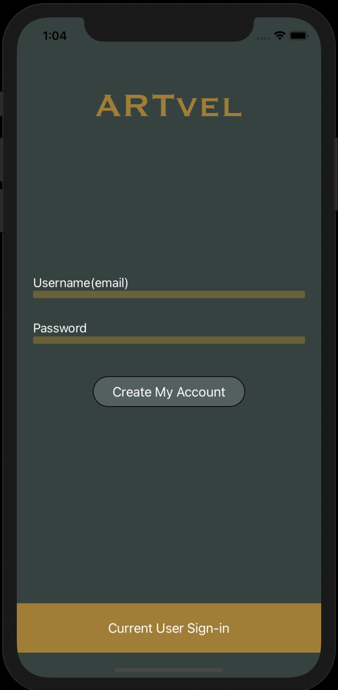
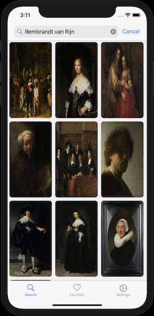
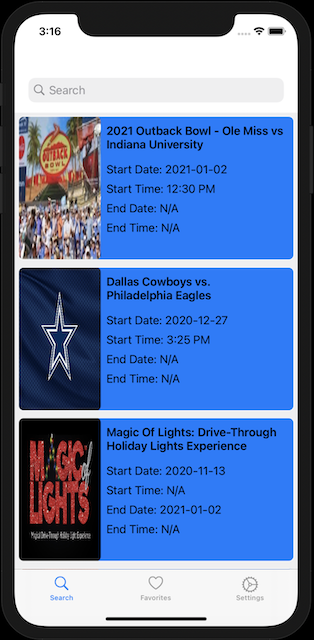

# ARTvel-App

## Overview

ARTvel is a dual experience app for the purpose of discovery. The first type of discovery is for art pieces from Rijksmuseum. The second allows users to discover events happening all over the country available through Ticketmaster. 

       
### Login                                         Rijksmuseum Experience                                        Ticketmaster Experience 

