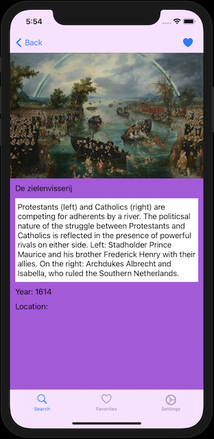
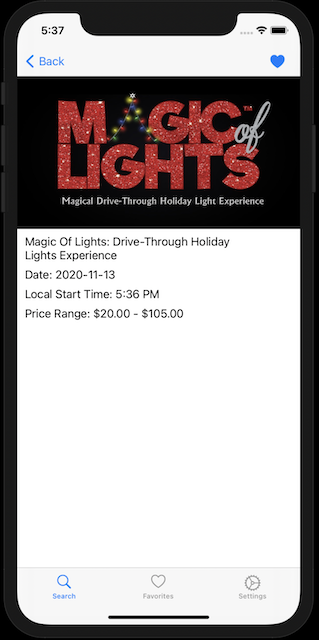
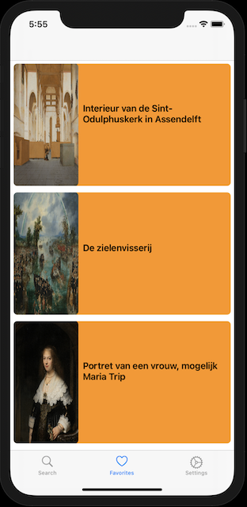

# ARTvel-App


## Overview

ARTvel is a dual experience app for the purpose of discovery. The first type of discovery is for art pieces from Rijksmuseum. The second allows users to discover events happening all over the country available through Ticketmaster. 

       
### Login  

 

## Features

### Search
Rijksmuseum: Search for art pieces by artist name.

Ticketmaster: Search for events based on address.

Rijksmuseum Experience | Ticketmaster Experience
---------------------- | -----------------------
 | 

### Details and Favorite

Rijksmuseum Experience | Ticketmaster Experience
---------------------- | -----------------------
 | 

### Browse Favorites



## Code Block

```swift
case .rijks:
    configureDataSourceFavoriteRijks()
    fetchFavoriteArtItems()
    favListener = Firestore.firestore().collection(DatabaseService.favoriteCollectionRijks).whereField("userID", isEqualTo: user.uid).addSnapshotListener({ (snapshot, error) in
        if let error = error {
            print(error)
        } else if let snapshot = snapshot {
            let favorites = snapshot.documents.map {ArtObject($0.data(), $0.data())}
            self.updateFavoriteSnapshotRijks(favoriteArtItems: favorites)
        }
    })
```

## Installation

### Prerequisites

* A developer account from Rijksmuseum for an API Key

* A developer account from Ticketmaster for a consumer key and consumer secret

* Clone this repo to your local machine using https://github.com/Juan-Ceballos/ARTvel-App.git

### Clone

## Built With

## Collaborators

[Juan Ceballos](https://github.com/Juan-Ceballos)

[](https://github.com/Juan-Ceballos)
