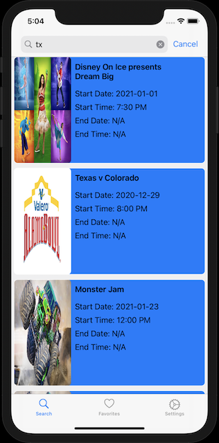

# ARTvel-App


## Overview

ARTvel is a dual experience app for the purpose of discovery. The first type of discovery is for art pieces from Rijksmuseum. The second allows users to discover events happening all over the country available through Ticketmaster. 

       
### Login  

 

## Features

### Search
Rijksmuseum: Search for art pieces by artist name.

Ticketmaster: Search for events based on address.

Rijksmuseum Experience | Ticketmaster Experience
---------------------- | -----------------------
 | 

### Details and Favorite

Rijksmuseum Experience | Ticketmaster Experience
---------------------- | -----------------------
 | 

### Browse Favorites


## Code Block

### Unit Testing

```swift
func testNetworkHelperRijkCollectionsAPI()   {
    let searchQuery = "Rembrandt van Rijn".addingPercentEncoding(withAllowedCharacters: .urlHostAllowed)!
    let exp = XCTestExpectation(description: "Art Objects Found")
    let collectionEndpoint = "https://www.rijksmuseum.nl/api/nl/collection?key=\(SecretKey.apiKey)&involvedMaker=\(searchQuery)"
    let request = URLRequest(url: URL(string: collectionEndpoint)!)
        
    NetworkHelper.shared.performDataTask(request: request) { (result) in
        switch result {
        case .failure(let error):
            print(error)
            XCTFail("\(error)")
        case .success(let data):
            exp.fulfill()
            XCTAssertGreaterThan(data.count, 20_000, "data should be greater than \(data.count)")
        }
    }
    wait(for: [exp], timeout: 5.0)
        
}
```

### RESTful API Fetch Request

```Swift
public static func fetchArtObjects(searchQuery: String, completion: @escaping (Result<[ArtObject], AppError>) -> ())   {
    
    let urlSearchQuery = searchQuery.addingPercentEncoding(withAllowedCharacters: .urlHostAllowed)!
    
    let urlEndpoint = "https://www.rijksmuseum.nl/api/nl/collection?key=\(SecretKey.apiKey)&involvedMaker=\(urlSearchQuery)"
    
    guard let url = URL(string: urlEndpoint) else {
        completion(.failure(.badURL(urlEndpoint)))
        return
    }
    
    let urlRequest = URLRequest(url: url)
    
    NetworkHelper.shared.performDataTask(request: urlRequest) { (result) in
        switch result {
        case .failure(let appError):
            print(appError)
        case .success(let data):
            dump(data)
            
            do {
                let artCollection = try JSONDecoder().decode(ArtObjectWrapper.self, from: data)
                let artObjects = artCollection.artObjects
                completion(.success(artObjects))
            } catch {
                completion(.failure(.decodingError(error)))
            }
        }
    }
}
```

## Installation

### Prerequisites

* A developer account from Rijksmuseum for an API Key

* A developer account from Ticketmaster for a consumer key and consumer secret

### Clone

* Clone this repo to your local machine using `https://github.com/Juan-Ceballos/ARTvel-App.git`

### Setup

* Add a Swift file named Config to project directory.

* in file add following code

```swift
import Foundation

struct SecretKey {
    static let apiKey = "9oErvwz9"
    
    static let consumerKey = "ilcIXmyVPMkmtknNvujcHZ3BRPHzSrlq"
    static let consumerSecret = "G2FIotMbe04XUkgk"
}
```

## Built With

* XCode

* Swift

* Firebase Services

* Kingfisher

* SnapKit

## Collaborators

[Juan Ceballos](https://github.com/Juan-Ceballos)

[](https://github.com/Juan-Ceballos)
